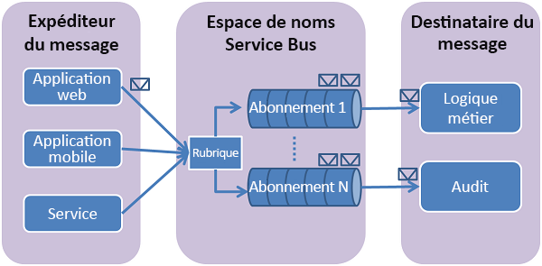
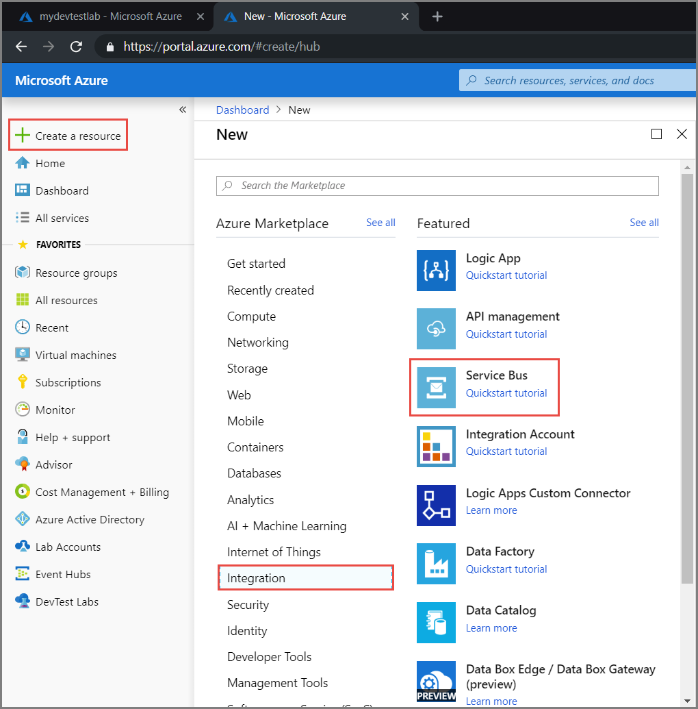
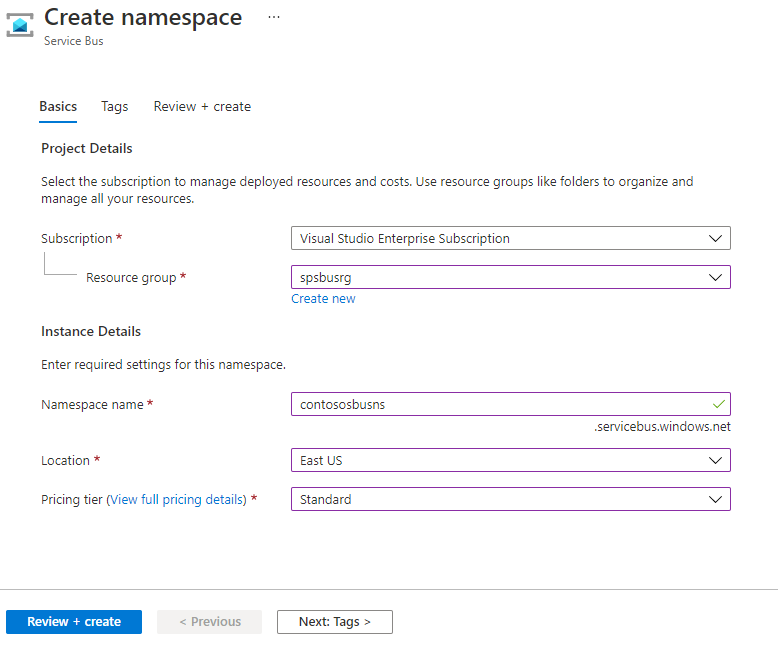
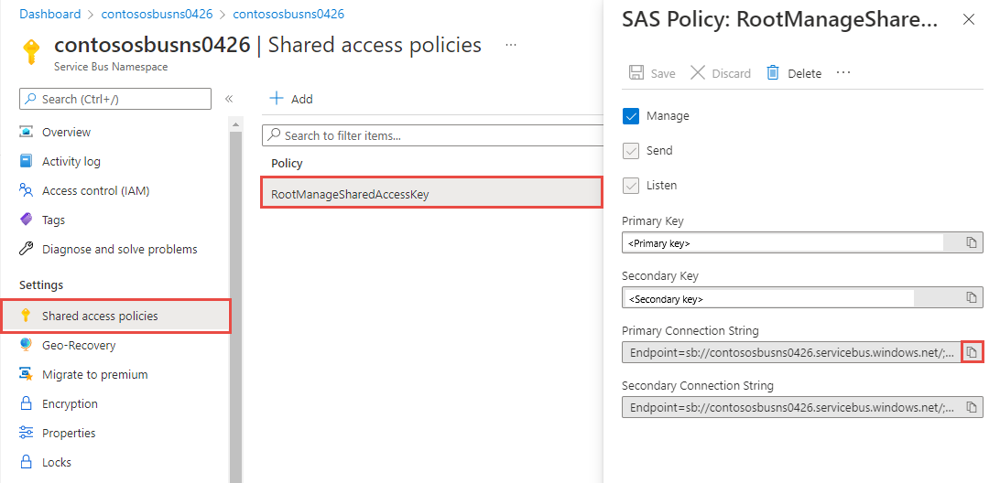
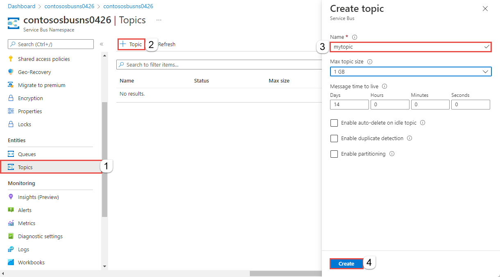

# Étapes de création de service bus

## Présentation des rubriques et des abonnements Service Bus

Les rubriques et les abonnements Service Bus prennent en charge un modèle de communication de messagerie de publication et d'abonnement . Lors de l’utilisation de rubriques et d’abonnements, les composants d’une application distribuée ne communiquent pas directement entre eux ; ils échangent plutôt des messages via une rubrique, qui fait office d’intermédiaire.

## Créer un espace de noms dans le Portail Azure

Pour commencer à utiliser des entités de messagerie Service Bus dans Azure, vous devez d’abord créer un espace de noms avec un nom unique dans Azure. Ce dernier fournit un conteneur d’étendue pour les ressources Service Bus au sein de votre application.

Pour créer un espace de noms :

1- Connectez-vous au portail Azure

2- Dans le volet de navigation de gauche du portail, sélectionnez + Créer une ressource, Intégration, puis Service Bus.

3- Dans l’étiquette De base de la page Créer un espace de noms, suivez ces étapes :

- Pour l’option Abonnement, choisissez un abonnement Azure dans lequel créer l’espace de noms.

- Pour l’option Groupe de ressources, choisissez un groupe de ressources existant dans lequel l’espace de noms sera utilisé, ou créez-en un nouveau.

- Entrez un nom pour l’espace de noms. Le nom de l’espace de noms doit respecter les conventions de nommage suivantes :

  - Le nom doit être unique dans tout Azure. Le système vérifie immédiatement si le nom est disponible.
  - Le nom doit inclure entre 6 et 50 caractères.
  - Le nom ne peut contenir que des lettres, des chiffres et des traits d’union (« - »).
  - Le nom doit commencer par une lettre, et se terminer par une lettre ou un chiffre.
  - Le nom ne se termine ni par « -sb » ni par « -mgmt ».

- Pour l’option Emplacement, choisissez la région dans laquelle héberger votre espace de noms.

- Pour le Niveau tarifaire, sélectionnez le SKU (De base, Standard ou Premium) destiné à l’espace de noms. Pour ce guide de démarrage rapide, sélectionnez Standard.

**Important : **

> Si vous voulez utiliser des rubriques et des abonnements, choisissez Standard ou Premium. Les rubriques/abonnements ne sont pas pris en charge dans le niveau tarifaire De base.

Si vous avez sélectionné le SKU Premium, précisez le nombre d’unité de messagerie. Le niveau Premium isole les ressources au niveau du processeur et de la mémoire, ce qui permet d’exécuter chaque charge de travail de manière isolée. Ce conteneur de ressources est appelé unité de messagerie. Un espace de noms Premium a au moins une unité de messagerie. Vous pouvez sélectionner 1, 2, 4, 8 ou 16 unités de messagerie pour chaque espace de noms Service Bus Premium. Pour plus d’informations, consultez Messagerie Service Bus Premium.

Sélectionnez Revoir + créer. Le système crée l’espace de noms de service et l’active. Vous devrez peut-être attendre plusieurs minutes afin que le système approvisionne des ressources pour votre compte.

## Obtenir la chaîne de connexion

Pour copier la chaîne de connexion primaire pour votre espace de noms, suivez ces étapes :

1.  Dans la page Espace de noms Service Bus, sélectionnez Stratégies d’accès partagé dans le menu de gauche.

2.  Dans la page Stratégies d’accès partagé, sélectionnez RootManageSharedAccessKey.

3.  Dans la fenêtre Stratégie : RootManageSharedAccessKey, cliquez sur le bouton Copier situé en regard de Chaîne de connexion primaire, pour copier la chaîne de connexion dans le presse-papiers pour une utilisation ultérieure. Copiez cette valeur dans le Bloc-notes ou un autre emplacement temporaire.

## Créer une rubrique à l’aide du Portail Azure

Dans la page Espace de noms Service Bus, sélectionnez Rubriques dans le menu de gauche.

1. Sélectionnez + Rubrique dans la barre d’outils.

2. Entrez un nom pour la rubrique. Conservez les valeurs par défaut des autres options.

3. Sélectionnez Create (Créer).

