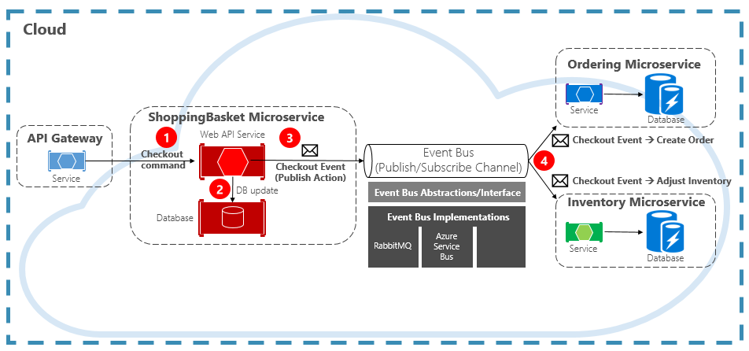
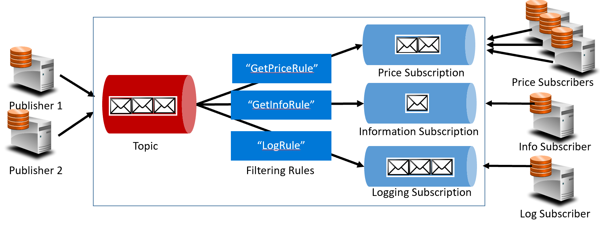
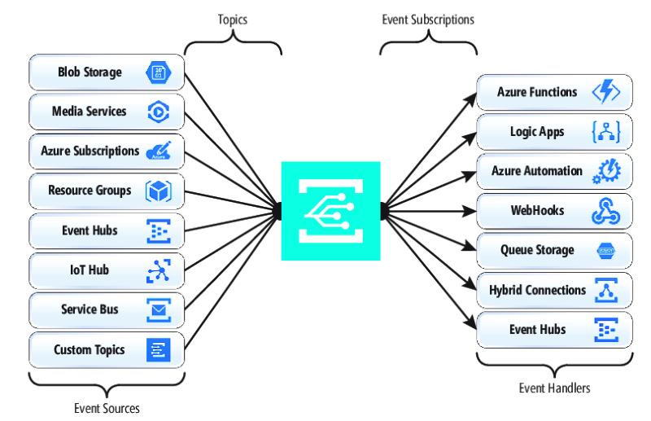
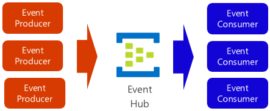

# Étude comparatif : azure service bus vs event grid vs event hub

La mise en file d’attente de message est un moyen efficace d’implémenter la communication où un producteur peut envoyer de façon asynchrone un message à un consommateur. Toutefois, que se passe-t-il lorsque de nombreux consommateurs différents s’intéressent au même message ? Une file d’attente de messages dédiée pour chaque consommateur n’est pas correctement mise à l’échelle et devient difficile à gérer.
Pour résoudre ce scénario, nous passons au troisième type d’interaction de message, l’événement. Un microservice annonce qu’une action s’est produite. D’autres microservices, s’ils sont intéressés, réagissent à l’action ou à l’événement.
L’événement est un processus en deux étapes. Pour une modification d’état donnée, un microservice publie un événement sur un répartiteur de messages, le rendant disponible pour tout autre microservice intéressé. Le microservice intéressé est averti en s’abonnant à l’événement dans le répartiteur de messages. Vous utilisez le modèle Publier/s’abonner pour implémenter la communication basée sur les événements.
La figure 4-15 montre un microservice de panier d’achat qui publie un événement avec deux autres microservices qui s’y abonnent.

**Figure 4-15. Messagerie Event-Driven**

Notez le composant Event Bus qui se trouve au milieu du canal de communication. Il s’agit d’une classe personnalisée qui encapsule le répartiteur de messages et la dissocie de l’application sous-jacente. Les microservices de commande et d’inventaire opèrent indépendamment l’événement sans connaissance les uns des autres, ni le microservice de panier d’achat. Lorsque l’événement inscrit est publié dans le bus d’événements, il agit dessus.
Avec l’événement, nous passons de la technologie de mise en file d’attente aux rubriques. Une rubrique est similaire à une file d’attente, mais prend en charge un modèle de messagerie un-à-plusieurs. Un microservice publie un message. Plusieurs microservices abonnés peuvent choisir de recevoir et d’agir sur ce message. La figure 4-16 illustre une architecture de rubrique.

**Figure 4-16. Architecture des rubriques**

Dans la figure précédente, les éditeurs envoient des messages à la rubrique. À la fin, les abonnés reçoivent des messages des abonnements. Au milieu, la rubrique transfère les messages aux abonnements en fonction d’un ensemble de règles, affichés dans des zones bleu foncé. Les règles agissent comme un filtre qui transfère des messages spécifiques à un abonnement. Ici, un événement « GetPrice » est envoyé aux abonnements de prix et de journalisation, car l’abonnement de journalisation a choisi de recevoir tous les messages. Un événement « GetInformation » est envoyé aux informations et aux abonnements de journalisation.
Le cloud Azure prend en charge deux services de rubrique différents : Azure Service Bus Rubriques et Azure EventGrid.

## Rubriques Azure Service Bus

Assis sur le même modèle de message réparti robuste de Azure Service Bus files d’attente sont Azure Service Bus Rubriques. Une rubrique peut recevoir des messages de plusieurs éditeurs indépendants et envoyer des messages à jusqu’à 2 000 abonnés. Les abonnements peuvent être ajoutés ou supprimés dynamiquement au moment de l’exécution sans arrêter le système ou recréer la rubrique.
De nombreuses fonctionnalités avancées de Azure Service Bus files d’attente sont également disponibles pour les rubriques, notamment la détection des doublons et la prise en charge des transactions. Par défaut, Service Bus rubriques sont gérées par un répartiteur de messages unique et stockées dans un magasin de messages unique. Toutefois, Service Bus partitionnement met à l’échelle une rubrique en la répartissant sur de nombreux répartiteurs de messages et magasins de messages.
La remise de messages planifiée étiquette un message avec un temps spécifique pour le traitement. Le message n’apparaît pas dans la rubrique avant cette heure. Le report de message vous permet de différer une récupération d’un message vers une heure ultérieure. Les deux sont couramment utilisés dans les scénarios de traitement de flux de travail où les opérations sont traitées dans un ordre particulier. Vous pouvez reporter le traitement des messages reçus jusqu’à ce que le travail précédent soit terminé.
Service Bus rubriques sont une technologie robuste et éprouvée pour activer la communication de publication/abonnement dans vos systèmes natifs cloud.

## Azure Event Grid

Bien que Azure Service Bus soit un répartiteur de messagerie testé par la bataille avec un ensemble complet de fonctionnalités d’entreprise, Azure Event Grid est le nouvel enfant sur le bloc.
À première vue, Event Grid peut ressembler à un autre système de messagerie basé sur des rubriques. Toutefois, il est différent de plusieurs façons. Axé sur les charges de travail pilotées par les événements, il permet le traitement des événements en temps réel, l’intégration Azure approfondie et une plateforme ouverte , toutes sur l’infrastructure serverless. Il est conçu pour les applications cloud natives et serverless contemporaines
En tant que backplan de sauvegarde d’événements centralisé ou de canal, Event Grid réagit aux événements à l’intérieur des ressources Azure et à partir de vos propres services.
Les notifications d’événements sont publiées dans une rubrique Event Grid, qui, à son tour, achemine chaque événement vers un abonnement. Les abonnés mappent aux abonnements et consomment les événements. Comme Service Bus, Event Grid prend en charge un modèle d’abonné filtré où un abonnement définit une règle pour les événements qu’il souhaite recevoir. Event Grid offre un débit rapide avec une garantie de 10 millions d’événements par seconde permettant une livraison en quasi temps réel , bien plus que ce que Azure Service Bus peut générer.
Un endroit doux pour Event Grid est son intégration approfondie dans l’infrastructure d’Azure. Une ressource Azure, telle que Cosmos DB, peut publier des événements intégrés directement sur d’autres ressources Azure intéressées, sans avoir besoin de code personnalisé. Event Grid peut publier des événements à partir d’un abonnement Azure, d’un groupe de ressources ou d’un service, ce qui donne aux développeurs un contrôle précis sur le cycle de vie des ressources cloud. Toutefois, Event Grid n’est pas limité à Azure. Il s’agit d’une plateforme ouverte qui peut consommer des événements HTTP personnalisés publiés à partir d’applications ou de services tiers et acheminer des événements vers des abonnés externes.
Lors de la publication et de l’abonnement à des événements natifs à partir de ressources Azure, aucun codage n’est requis. Avec une configuration simple, vous pouvez intégrer des événements d’une ressource Azure à un autre en tirant parti de la plomberie intégrée pour les rubriques et les abonnements. La figure 4-17 montre l’anatomie d’Event Grid.

**Figure 4-17. Anatomie event Grid**

Une différence majeure entre EventGrid et Service Bus est le modèle d’échange de messages sous-jacent.
Service Bus implémente un modèle d’extraction de style plus ancien dans lequel l’abonné en aval interroge activement l’abonnement à la rubrique pour les nouveaux messages. À la hausse, cette approche donne à l’abonné un contrôle total du rythme auquel il traite les messages. Il contrôle le moment et le nombre de messages à traiter à tout moment. Les messages non lus restent dans l’abonnement jusqu’à ce qu’ils soient traités. Une lacune significative est la latence entre le moment où l’événement est généré et l’opération d’interrogation qui extrait ce message à l’abonné pour le traitement. En outre, la surcharge de l’interrogation constante pour l’événement suivant consomme des ressources et de l’argent.
EventGrid, cependant, est différent. Il implémente un modèle Push dans lequel les événements sont envoyés aux Gestionnaires d’événements comme reçus, donnant une remise d’événements en quasi temps réel. Il réduit également le coût en tant que service est déclenché uniquement lorsqu’il est nécessaire de consommer un événement , pas continuellement comme avec l’interrogation. Cela dit, un gestionnaire d’événements doit gérer la charge entrante et fournir des mécanismes de limitation pour se protéger contre une surcharge. De nombreux services Azure qui consomment ces événements, tels que Azure Functions et Logic Apps, fournissent des fonctionnalités de mise à l’échelle automatique automatique pour gérer des charges accrues.
Event Grid est un service cloud serverless entièrement géré. Il est mis à l’échelle dynamiquement en fonction de votre trafic et vous charge uniquement pour votre utilisation réelle, et non pour la capacité pré-achetée. Les 100 000 premières opérations par mois sont gratuites : les opérations définies en tant qu’entrée d’événement (notifications d’événements entrantes), les tentatives de remise d’abonnement, les appels de gestion et le filtrage par sujet. Avec une disponibilité de 99,99 %, EventGrid garantit la livraison d’un événement au cours d’une période de 24 heures, avec des fonctionnalités de nouvelle tentative intégrées pour une livraison infructueuse. Les messages non envoyés peuvent être déplacés vers une file d’attente de lettres mortes pour la résolution. Contrairement à Azure Service Bus, Event Grid est paramétré pour des performances rapides et ne prend pas en charge les fonctionnalités telles que la messagerie ordonnée, les transactions et les sessions.
Diffusion en continu de messages dans le cloud Azure
Azure Service Bus et Event Grid prennent en charge les applications qui exposent des événements uniques et discrets comme un nouveau document ont été insérés dans une base de données Cosmos. Mais que se passe-t-il si votre système natif cloud doit traiter un flux d’événements connexes ? Les flux d’événements sont plus complexes . Ils sont généralement ordonnés, liés à l’heure et doivent être traités en tant que groupe.
Azure Event Hub est une plateforme de diffusion en continu de données et un service d’ingestion d’événements qui collecte, transforme et stocke des événements. Il est affiné pour capturer les données de diffusion en continu, telles que les notifications d’événements continus émises à partir d’un contexte de télémétrie. Le service est hautement évolutif et peut stocker et traiter des millions d’événements par seconde. Illustré dans la figure 4-18, il s’agit souvent d’une porte d’entrée pour un pipeline d’événements, découplant le flux d’ingestion à partir de la consommation d’événements.

**Figure 4-18. Azure Event Hub**

Event Hub prend en charge la faible latence et la rétention de temps configurable. Contrairement aux files d’attente et aux rubriques, Event Hubs conserve les données d’événements après avoir été lues par un consommateur. Cette fonctionnalité permet à d’autres services d’analyse de données, internes et externes, de relire les données pour une analyse plus approfondie. Les événements stockés dans le hub d’événements ne sont supprimés qu’à l’expiration de la période de rétention, soit un jour par défaut, mais configurables.
Event Hub prend en charge les protocoles de publication d’événements courants, notamment HTTPS et AMQP. Il prend également en charge Kafka 1.0. Les applications Kafka existantes peuvent communiquer avec Event Hub à l’aide du protocole Kafka qui offre une alternative à la gestion de clusters Kafka volumineux. De nombreux systèmes natifs cloud open source adoptent Kafka.
Event Hubs implémente le streaming de messages via un modèle de consommateur partitionné dans lequel chaque consommateur lit uniquement un sous-ensemble spécifique ou une partition du flux de messages. Ce modèle permet de disposer d'une échelle horizontale considérable pour le traitement des événements, et offre d'autres fonctionnalités axées sur le flux, qui ne sont pas disponibles dans les rubriques et les files d'attente. Une partition est une séquence ordonnée d’événements qui est conservée dans un concentrateur d’événements. Les événements les plus récents sont ajoutés à la fin de cette séquence. La figure 4-19 montre le partitionnement dans un hub d’événements.

**Figure 4-19. Partitionnement event Hub**

Au lieu de lire à partir de la même ressource, chaque groupe de consommateurs lit sur un sous-ensemble ou une partition du flux de messages.
Pour les applications natives cloud qui doivent diffuser en continu un grand nombre d’événements, Azure Event Hub peut être une solution robuste et abordable.
